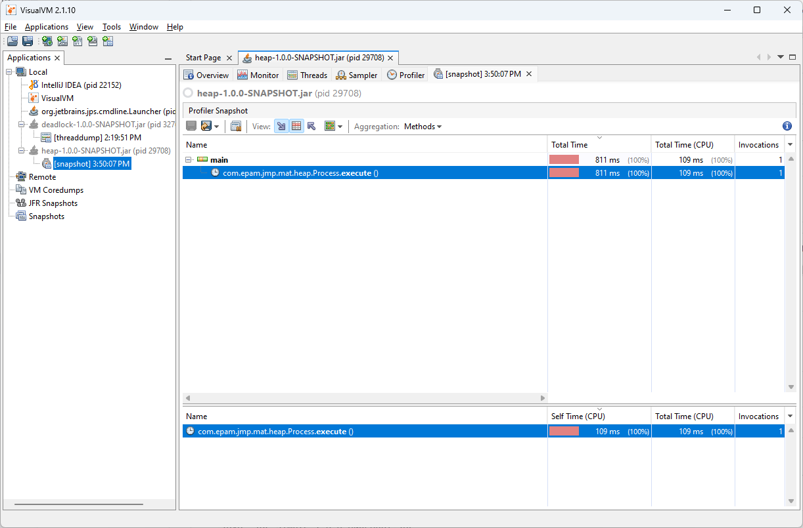

**Which interface JDK tools use to connect to JVM locally?**

_JDK tools such as jconsole, jstack, jmap, and jstat use the Java Virtual Machine Tool Interface (JVM TI) and Java Management Extensions (JMX) to connect to the JVM locally._

**What is difference between profiling and traceability?**

| **Aspect**         | **Profiling**                         | **Traceability**                     |
|---------------------|---------------------------------------|---------------------------------------|
| **Purpose**         | Performance optimization             | Requirement tracking and debugging    |
| **Focus**           | Runtime behavior and resource usage  | Relationship between development artifacts |
| **Output**          | Metrics on execution time, memory, etc. | Traceability matrices or execution flow |
| **Tools**           | Performance analysis tools (e.g., JProfiler) | SDLC management tools (e.g., JIRA)   |
| **Scope**           | Performance of running applications  | Lifecycle of requirements and their implementation |
| **Typical Use Case**| Identifying slow code or resource bottlenecks | Debugging errors, ensuring requirements coverage |

## observation of how jvm heap grows, during oom error
    java -jar -Xmx100m heap-1.0.0-SNAPSHOT.jar

* heap observation on oom

* heap dump analysis

### Get heap dump
* get heap dump using jcmd
`jcmd <pid> GC.heap_dump <filename>`

* get heap dump using jmap

`  jmap -dump:format=b,file=snapshot.hprof <pid>`

### Get heap histogram
`jcmd <pid> GC.class_histogram`
* observation of gc histogram
  
* Using jmap
`  jmap -histo <pid> `

### Analyze heap dump
* with oql 

select objs from java.lang.Object[] objs where objs.length > 100

## Deadlock troubleshooting

    jcmd <pid> Thread.print

## Remote JVM profiling
    java -jar -Dcom.sun.management.jmxremote -Dcom.sun.management.jmxremote.port=7890 -Dcom.sun.management.jmxremote.authenticate=false -Dcom.sun.management.jmxremote.ssl=false simple-1.0.0-SNAPSHOT.jar
Connect to JVM using jconsole:

    jconsole localhost:7890

## Inspect a Flight Recording
`
   java -jar -Xmx100m -XX:+FlightRecorder -XX:StartFlightRecording=dumponexit=true,filename=flight.jfr heap-1.0.0-SNAPSHOT.jar
` starting from java 11 no need to add this flag -XX:+UnlockCommercialFeatures

## jinfo
`
  VM Flags:
  -XX:CICompilerCount=4 -XX:ConcGCThreads=2 -XX:+FlightRecorder -XX:G1ConcRefinementThreads=8 -XX:G1EagerReclaimRemSetThreshold=12 -XX:G1HeapRegionSize=1048576 -XX:G1RemSetArrayOfCardsEntries=12 -XX:G1RemSetHowlMaxNumBuckets=8 -XX:G1RemSetHowlNumBuckets=4 -XX:GCDrainStackTargetSize=64 -XX:InitialHeapSize=104857600 -XX:MarkStackSize=4194304 -XX:MaxHeapSize=104857600 -XX:MaxNewSize=62914560 -XX:MinHeapDeltaBytes=1048576 -XX:MinHeapSize=8388608 -XX:NonNMethodCodeHeapSize=5839372 -XX:NonProfiledCodeHeapSize=122909434 -XX:ProfiledCodeHeapSize=122909434 -XX:ReservedCodeCacheSize=251658240 -XX:+SegmentedCodeCache -XX:SoftMaxHeapSize=104857600 -XX:StartFlightRecording=dumponexit=true,filename=flight.jfr -XX:+UseCompressedOops -XX:+UseFastUnorderedTimeStamps -XX:+UseG1GC -XX:-UseLargePagesIndividualAllocation
`

`
VM Arguments:
  jvm_args: -Xmx100m -XX:+FlightRecorder -XX:StartFlightRecording=dumponexit=true,filename=flight.jfr
  java_command: heap-1.0.0-SNAPSHOT.jar
  java_class_path (initial): heap-1.0.0-SNAPSHOT.jar
  Launcher Type: SUN_STANDARD
`